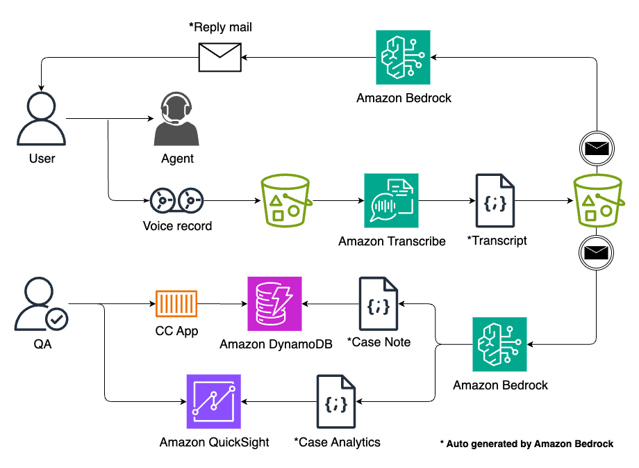
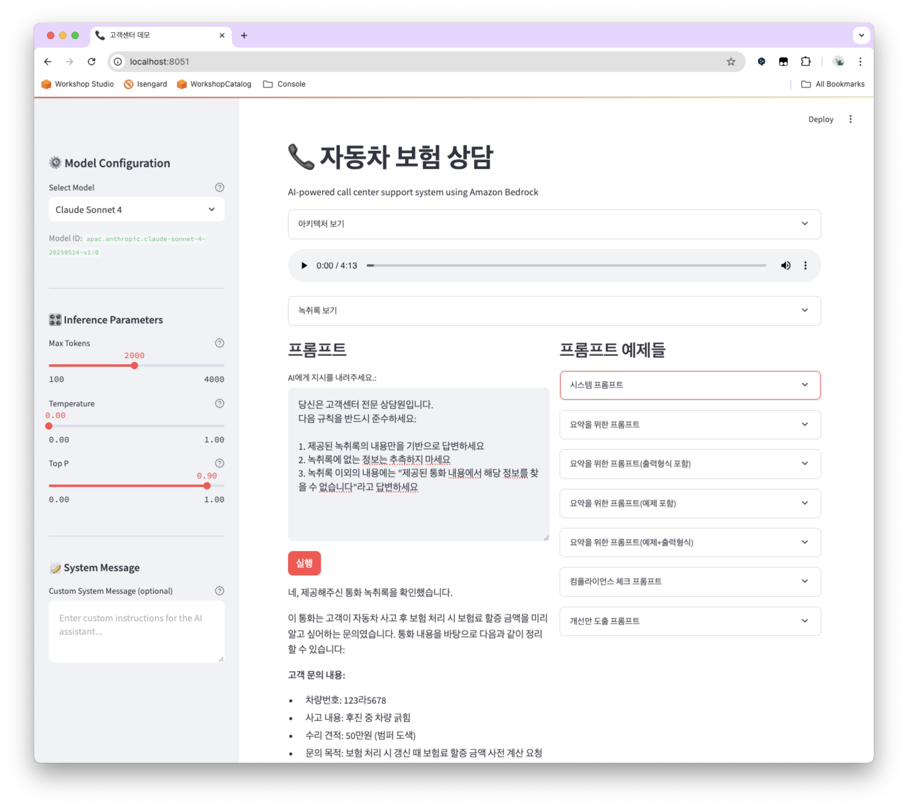

# 📞 AI 기반 자동차 보험 상담 시스템

Amazon Bedrock을 활용한 지능형 고객센터 지원 시스템입니다. 실제 상담 녹취록을 분석하고 AI 모델을 통해 다양한 상담 업무를 자동화할 수 있습니다.

## AI Call Center 가상 아키텍처


## 스크린샷


## ✨ 주요 기능

- **다중 AI 모델 지원**: Claude Sonnet 4, Claude 3.7 Sonnet, Nova Pro/Lite 등
- **실시간 스트리밍 응답**: 빠른 AI 응답 생성
- **상담 녹취록 분석**: 음성 파일과 텍스트 녹취록 제공
- **프롬프트 템플릿**: 요약, 컴플라이언스 체크, 개선안 도출 등
- **직관적인 웹 인터페이스**: Streamlit 기반 사용자 친화적 UI

## 🚀 설치 및 실행

### 1. 저장소 클론
```bash
git clone <repository-url>
cd call-center
```

### 2. 가상환경 설정
```bash
python3 -m venv venv
source venv/bin/activate  # macOS/Linux
# Windows의 경우: venv\Scripts\activate
```

### 3. 의존성 설치
```bash
pip install -r requirements.txt
```

### 4. 환경 변수 설정
```bash
cp .env.example .env
# .env 파일을 편집하여 AWS 자격 증명을 설정하세요
```

### 5. 애플리케이션 실행
```bash
streamlit run app.py
```

## 📁 프로젝트 구조
```
call-center/
├── README.md
├── requirements.txt
├── .env.example
├── .env
├── .gitignore
├── app.py                    # 메인 Streamlit 애플리케이션
├── prompt_examples.yaml      # 프롬프트 템플릿 모음
├── images/
│   └── call-center-01.png   # 아키텍처 다이어그램
├── media/
│   ├── *.mp3                # 상담 음성 파일
│   └── *.txt                # 상담 녹취록
├── utils/
│   ├── __init__.py
│   └── bedrock.py           # Amazon Bedrock 클라이언트
└── venv/                    # 가상환경
```

## 🔧 사용 방법

### 1. 모델 설정
- 사이드바에서 원하는 AI 모델 선택 (Claude Sonnet 4, Nova Pro 등)
- 추론 매개변수 조정 (Max Tokens, Temperature, Top P)
- 필요시 커스텀 시스템 메시지 입력

### 2. 상담 분석
- 제공된 녹취록을 확인
- 프롬프트 예제에서 원하는 템플릿 선택
- 프롬프트 입력 후 "실행" 버튼 클릭

### 3. 프롬프트 템플릿 활용
- **요약**: 상담 내용을 구조화된 형태로 요약
- **컴플라이언스 체크**: 상담 품질 및 규정 준수 확인
- **개선안 도출**: 상담 프로세스 개선 방안 제시

## 🛠️ 기술 스택

- **Frontend**: Streamlit
- **AI/ML**: Amazon Bedrock (Claude, Nova 모델)
- **Backend**: Python, Boto3
- **Configuration**: YAML, Environment Variables

## ⚙️ 환경 설정

`.env` 파일에 다음 AWS 자격 증명을 설정하세요:

```bash
AWS_ACCESS_KEY_ID=your_access_key
AWS_SECRET_ACCESS_KEY=your_secret_key
AWS_DEFAULT_REGION=ap-northeast-2
```

## 📋 요구사항

- Python 3.8+
- AWS 계정 및 Bedrock 액세스 권한
- 지원되는 AI 모델에 대한 액세스 권한

## 🤝 기여하기

1. Fork the project
2. Create your feature branch (`git checkout -b feature/AmazingFeature`)
3. Commit your changes (`git commit -m 'Add some AmazingFeature'`)
4. Push to the branch (`git push origin feature/AmazingFeature`)
5. Open a Pull Request

## 📄 라이선스

이 프로젝트는 MIT 라이선스 하에 배포됩니다.